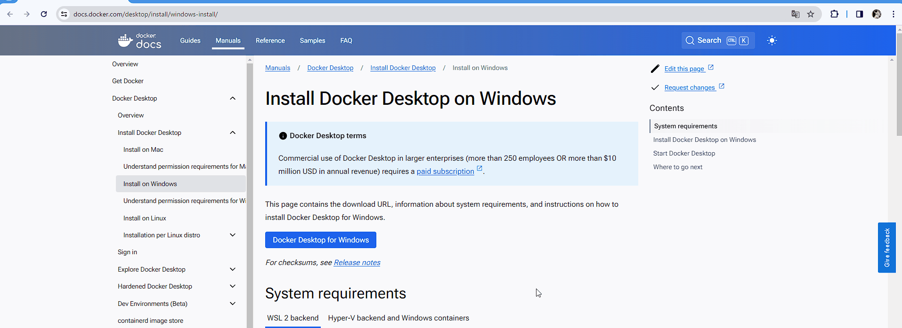
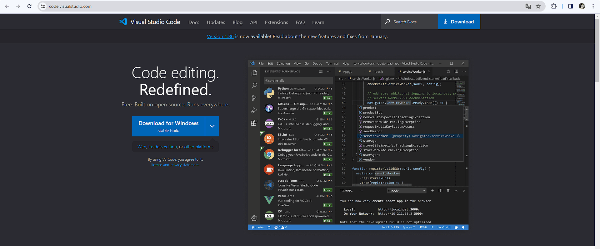
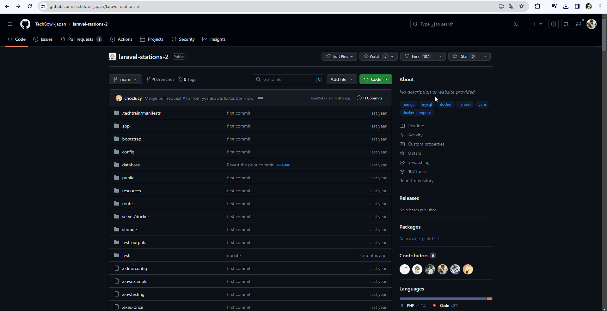

# 環境構築

## 概要

TechTrain Railway の問題を解くために必要な下記ツールのインストール方法と環境構築の手順を解説します。
- Docker
- Visual Studio Code
- Git

## 手順

1. Docker Desktopのインストール
    - [Install Docker Desktop on Windows](https://docs.docker.com/desktop/install/windows-install/) からDocker Desktopをダウンロードし、インストールします。  
    
    - Docker Desktopをインストールした後、一度PCを再起動してからDocker Desktopを起動してください。
    - これにより、Dockerが正しく動作するか確認できます。
2. Visual Studio Codeのインストール
    - [Visual Studio Code](https://code.visualstudio.com/) から自分のOSに適したVisual Studio Codeをダウンロードします。
    
3. Visual Studio CodeにTechTrain Railwayのクリア条件を判定するツールをインストール
    - Visual Studio Codeを開き、拡張機能（Extensions）から「TechTrain Railway」という拡張機能を検索してインストールします。これにより、Railwayのクリア条件を簡単に判定できるようになります。
    
4. GitHubリポジトリのフォークとダウンロード
    1. GitHubリポジトリのフォーク
        - [TechBowl-japan/laravel-stations-2 | GitHub](https://github.com/TechBowl-japan/laravel-stations-2) にアクセスし、右上の"Fork"ボタンをクリックして、リポジトリを自分のGitHubアカウントにフォークします。  
        
    2. Gitのインストール
        - GitHubからリポジトリをクローンするためには、Gitが必要です。  
        - インストールされていない場合は、[Gitの公式サイト](https://git-scm.com/download/win) の"Click here to download"をクリックし、ダウンロードします。
    3. GitHubリポジトリのダウンロード
        - フォークが完了したら、自分のGitHubアカウント上でフォークされたリポジトリを選択し、"Code"ボタンをクリックして、リポジトリのURLをコピーします。  
        - そして、PowerShellを開いて以下のコマンドを実行してリポジトリをダウンロードします。
        ```bash
        git clone https://github.com/{{あなたのGitHubID}}/laravel-stations-2.git
        ```
5. Visual Studio Codeでダウンロードしたリポジトリを開く
    - リポジトリをダウンロードしたディレクトリで右クリックし、"Open with Code"または"Visual Studio Code で開く"を選択します。
    - または、コマンドラインで以下のコマンドを実行して、リポジトリのディレクトリをVisual Studio Codeで開きます。
    ```bash
    code ダウンロードしたリポジトリのディレクトリ
    ```
    - Visual Studio Codeが起動したら、左上のファイル -> フォルダを開くを選択して、ダウンロードしたリポジトリのディレクトリを選択します。
6. Visual Studio Codeからターミナルを起動し環境構築する
    - 左上のターミナル -> 新しいターミナルを選択して、ターミナルを起動します。  
    - 以下のコマンドを実行し、アプリケーションの環境固有（データベースへの接続情報等）の設定や機密情報を格納する `.env` ファイルを作成します。
    ```bash
    cp .env.example .env
    ```
    - 以下のコマンドを実行し、Dockerコンテナのビルドを行います。
    ```bash
    docker compose build --no-cache
    ```  
   ※ Dockerコンテナのビルドおよび起動には時間がかかる場合があります。コマンドが正常に完了するまで待ってください。
7. Dockerコマンドでコンテナを起動
    - ターミナルでリポジトリのディレクトリに移動し、以下のコマンドを実行してDockerコンテナを起動します。
    ```bash
    docker compose up -d
    ```
    ※ Dockerコンテナのビルドおよび起動には時間がかかる場合があります。コマンドが正常に完了するまで待ってください。
8. Dockerコマンドでコンテナの起動を確認
    - 以下のコマンドを実行し、手順7.で起動したDockerコンテナのプロセスが起動しているかを確認してください。
    ```bash
    docker compose ps
    ```
    ※ Dockerが使用するポートが他のアプリケーションと競合していないか確認してください。
9. Laravelに必要なライブラリをインストール  
    - 以下のコマンドを実行し、ライブラリをインストールします。
    ```bash
    docker compose exec php-container composer install
    ```
10. .envファイルの確認
    - .env ファイル内の `APP_KEY=` の右辺が空白の場合、下記のコマンドを実行しLaravel アプリケーションのセキュリティに関するキーを生成します。
    ```bash
    docker compose exec php-container php artisan key:generate
    ```
    - .env ファイル内の `APP_KEY=` にキーが登録されたことを確認し、以下のコマンドを実行します。
    ```bash
    docker compose up -d
    ```
11. ローカルサーバが立ち上がっていることを確認
    - [http://localhost:8888](http://localhost:8888) にアクセスし、ローカルサーバが立ち上がっていることを確認します。
12. 環境構築完了後の確認  
    - 環境構築が正常に終了したことを確認するために、Visual Studio Codeでリポジトリを開いてから、ファイルの変更や追加ができるか確認してください。  
    - また、TechTrain Railwayの拡張機能が正しく機能しているかも確認してください。
---
以上でLaravel Railwayに取り組むための環境が整いました。
Visual Studio Codeを使用してコードを編集し、「TechTrain Railway」という拡張機能から「できた!」と書かれた青いボタンをクリックすると判定が始まります。
